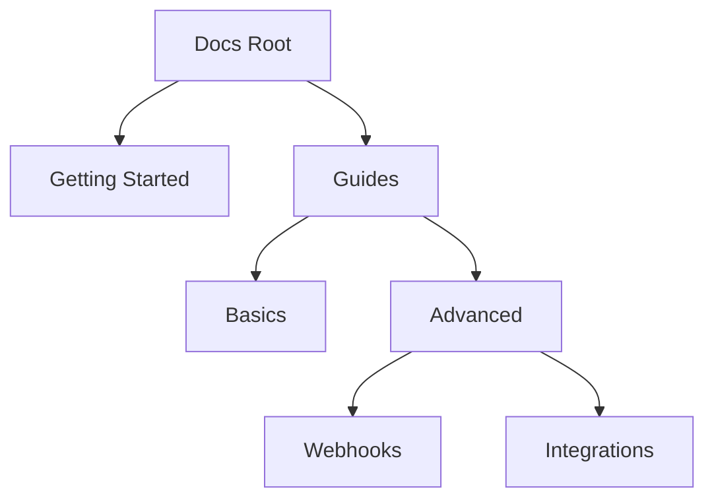

## Overview

You manage your Hai Tran Documentation space by creating pages, organizing them into hierarchies, and collaborating with your team. This guide walks you through the essential workflows to keep your docs structured and up-to-date. Start with simple page creation and scale to advanced organization.

<Callout kind="tip">
  Use the search bar in the sidebar to quickly find and edit existing pages.
</Callout>

## Creating and Editing Pages

Follow these steps to create a new documentation page directly in the platform.

<Steps>
  <Step title="Navigate to Pages" icon="file-text">
    Open the sidebar and select the **Pages** section. Click the **New Page** button at the top.
  </Step>
  <Step title="Set Frontmatter" icon="settings">
    Add YAML frontmatter at the top of your page:

    ```yaml
    ---
    title: My New Page
    description: A brief overview of this page.
    ---
    ```
  </Step>
  <Step title="Write Content" icon="edit-3">
    Use Markdown and MDX components for rich content. Preview changes in real-time.
  </Step>
  <Step title="Publish" icon="upload">
    Click **Publish** to make the page live. Changes save automatically for drafts.
  </Step>
</Steps>

For programmatic creation, use the CLI tool.

<Tabs>
  <Tab title="npm" icon="package">
    ```bash
    npm install -g hai-docs-cli
    hai-docs create my-page.mdx --title "API Reference"
    ```
  </Tab>
  <Tab title="pnpm" icon="package">
    ```bash
    pnpm add -g hai-docs-cli
    hai-docs create my-page.mdx --title "API Reference"
    ```
  </Tab>
</Tabs>

## Organizing Content Hierarchies

Structure your docs with nested pages and sidebars for intuitive navigation.

| Hierarchy Level | Example Path | Purpose |
|-----------------|--------------|---------|
| Root            | `/`          | Landing page |
| Section         | `/guides/`   | Grouped tutorials |
| Subsection      | `/guides/advanced/` | Detailed topics |
| Page            | `/guides/advanced/webhooks.mdx` | Specific content |



<Columns cols={2}>
  <Card title="Drag and Drop" icon="move" href="#">
    Reorder pages in the sidebar by dragging them into position.
  </Card>
  <Card title="Custom Sidebars" icon="layout" href="#">
    Define sidebar menus in `sidebar.json` for complex structures.
  </Card>
</Columns>

## Collaboration Features

Invite team members and streamline reviews.

<CodeGroup tabs="Invite,Review">
  ```json
  {
    "team": [
      { "email": "alice@team.com", "role": "editor" },
      { "email": "bob@team.com", "role": "viewer" }
    ]
  }
  ```
  ```json
  {
    "review": {
      "required": 2,
      "approvers": ["alice@team.com"]
    }
  }
  ```
</CodeGroup>

<ExpandableGroup>
  <Expandable title="Advanced Permissions" default-open="false">
    Set granular roles:

    | Role     | Create Pages | Edit Pages | Publish |
    |----------|--------------|------------|---------|
    | Admin    | Yes          | Yes        | Yes     |
    | Editor   | Yes          | Yes        | No      |
    | Viewer   | No           | No         | No      |

    Use the **Team Settings** panel to assign roles.
  </Expandable>
  <Expandable title="Version History">
    Access previous versions via the page history icon. Restore or compare changes easily.
  </Expandable>
</ExpandableGroup>

## Next Steps

<Columns cols={3}>
  <Card title="API Reference" icon="code" href="/docs/api">
    Integrate programmatically.
  </Card>
  <Card title="Customization" icon="palette" href="/docs/customize">
    Theme your docs with brand colors like `#3B82F6`.
  </Card>
  <Card title="Deploy" icon="rocket" href="/docs/deploy">
    Host on your domain.
  </Card>
</Columns>

<Callout kind="success">
  Your documentation space scales with your project. Regularly review hierarchies for optimal user experience.
</Callout>