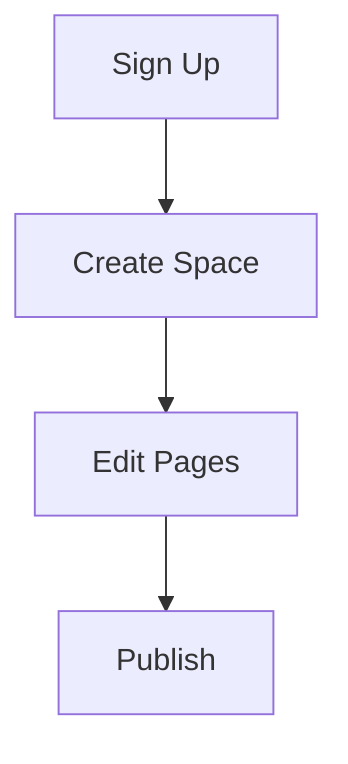

## Get Started in Minutes

Hai Tran Documentation helps you organize project docs efficiently. Follow these steps to create your account, set up your first doc space, and start editing. You complete setup in under five minutes.

<Callout kind="tip">
  Use a strong password and enable two-factor authentication for security.
</Callout>

<Steps>
  <Step title="Create Your Account" icon="user-plus">
    Visit the [Hai Tran Documentation signup page](https://app.haitran-docs.com/signup).

    Fill in your email, choose a username, and set a password. Verify your email via the confirmation link.

    After login, you land on the dashboard.

  </Step>

  <Step title="Set Up Your First Doc Space" icon="folder-plus">
    Click **New Doc Space** from the dashboard.

    Enter a name like `My Project Docs` and select a template (e.g., "API Reference" or "Blank").

    Customize settings:

    - Brand color: `#3B82F6`
    - Visibility: Public or Private

    Save to create your space.

  </Step>

  <Step title="Basic Navigation and Editing" icon="edit-3">
    In your doc space, use the sidebar for navigation.

    Create pages via **New Page**. Edit with the MDX editor.

    <Tabs>
      <Tab title="Markdown Basics" icon="edit">
        Write standard markdown:

        ````markdown
        # Page Title

        ## Section

        - List item
        - Another item
        ```
        ````

      </Tab>
      <Tab title="Add Components" icon="layers">
        Insert JSX components:

        ````jsx
        <Callout kind="info">
          This is a callout.
        </Callout>
        ```
        ````

      </Tab>
    </Tabs>

    Preview changes live. Publish with **Deploy**.

  </Step>
</Steps>

## Quick Navigation Reference

Use these cards to jump to common tasks.

<Columns cols={3}>
  <Card title="Customize Theme" icon="palette" href="/docs/customize">
    Adjust colors and logos to match your brand.
  </Card>

  <Card title="Add Team Members" icon="users" href="/docs/collaboration">
    Invite collaborators and set permissions.
  </Card>

  <Card title="Embed Code Examples" icon="code">
    <CodeGroup tabs="JavaScript,Python">
      ```javascript
      const client = new HaiTranClient({ apiKey: 'YOUR_API_KEY' });
      const docs = await client.getSpaces();
      console.log(docs);
      ```

      ```python
      from haitran import Client
      client = Client(api_key="YOUR_API_KEY")
      docs = client.get_spaces()
      print(docs)
      ```
    </CodeGroup>
  </Card>
</Columns>

## Advanced Editing Tips

<Expandable title="Embed Diagrams (Optional)" default-open="false">

Add flowcharts using mermaid code blocks:



</Expandable>

You now have a fully functional doc space. Explore features like version history and search next.

<Callout kind="success">
  Congrats! Your first doc space is live. Share the URL with your team.
</Callout>